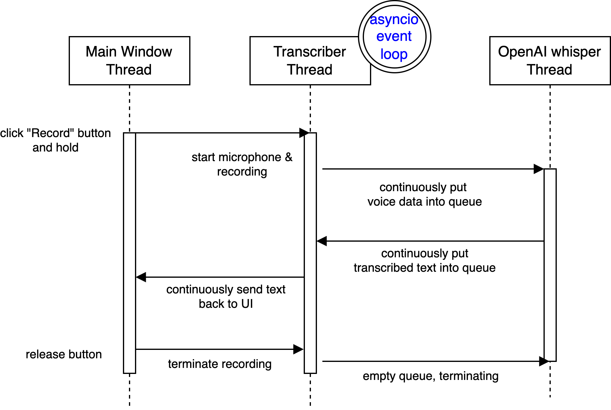
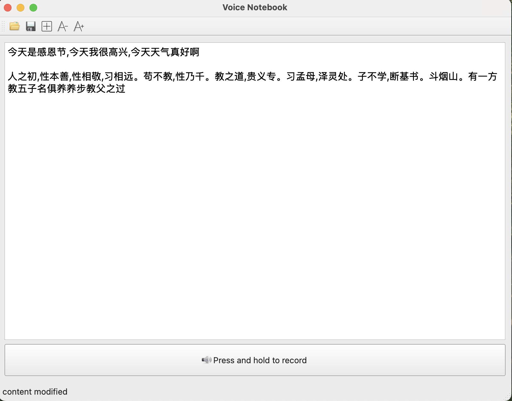

# Speech notebook

A lightweight Python GUI application that use [OpenAI's whisper](https://github.com/openai/whisper) to convert speech to text.

The application UI builds on top of PyQt6. 



As shown in the screenshot below, when the record button is pressed down and held, the main window starts a transcriber thread to run 3 tasks concurrently:
* a Python asyncio task to collect audio stream from microphone and put into an audio data queue
* an OpenAI whisper model is loaded in a dedicated thread which listens to the audio data queue, transcribes audio into text, and continuously puts transcribed text into a text data queue
* a Python asyncio task listens to the text data queue and sends text back to the main window.

Once the record button is released, the transcriber thread is terminated.

So basically the two queues, audio and transcribed text queue, connect 3 concurrent tasks to form a pipeline that continuously transribes audio from microphone to the main window.




## Setup

Install port audio. For example, on Mac,
```shell
$ brew install portaudio
```

Create a Python virtual environment, and inside the virtual environment, install Python packages listed in `requirements.txt`. For example:
```shell
pip install -r requirements.txt
```
Config the language you use in `config.txt`.

To run the program, `python ./voice_notebook.py`.

